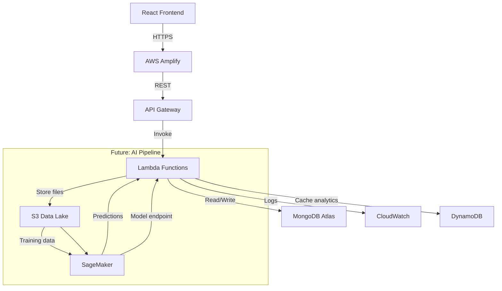

# EVision AI — AWS Deployment Guide

## Architecture



---

## 1. Prerequisites

- AWS CLI configured (`aws configure`)
- Node.js 20+
- MongoDB Atlas account (free tier works)
- AWS account with IAM permissions for: Lambda, API Gateway, S3, DynamoDB, CloudWatch, Amplify

---

## 2. MongoDB Atlas Setup

1. Create cluster at https://cloud.mongodb.com
2. Whitelist IP `0.0.0.0/0` (or your Lambda NAT IP)
3. Create database user
4. Copy connection string → `MONGODB_URI` in environment

---

## 3. S3 Data Lake

```bash
# Create bucket
aws s3 mb s3://evision-ai-data-lake --region us-east-1

# Enable versioning
aws s3api put-bucket-versioning \
  --bucket evision-ai-data-lake \
  --versioning-configuration Status=Enabled

# Block public access
aws s3api put-public-access-block \
  --bucket evision-ai-data-lake \
  --public-access-block-configuration \
  BlockPublicAcls=true,IgnorePublicAcls=true,BlockPublicPolicy=true,RestrictPublicBuckets=true
```

---

## 4. DynamoDB (Analytics Cache)

```bash
aws dynamodb create-table \
  --table-name evision-analytics-cache \
  --attribute-definitions AttributeName=cacheKey,AttributeType=S \
  --key-schema AttributeName=cacheKey,KeyType=HASH \
  --billing-mode PAY_PER_REQUEST \
  --region us-east-1
```

---

## 5. Lambda Deployment

### Install serverless-http

```bash
cd backend
npm install serverless-http
```

### serverless.yml

```yaml
service: evision-ai-backend
frameworkVersion: '3'

provider:
  name: aws
  runtime: nodejs20.x
  region: us-east-1
  environment:
    MONGODB_URI: ${env:MONGODB_URI}
    AWS_S3_BUCKET: evision-ai-data-lake
  iamRoleStatements:
    - Effect: Allow
      Action:
        - s3:PutObject
        - s3:GetObject
      Resource: arn:aws:s3:::evision-ai-data-lake/*
    - Effect: Allow
      Action:
        - dynamodb:PutItem
        - dynamodb:GetItem
        - dynamodb:Query
      Resource: arn:aws:dynamodb:us-east-1:*:table/evision-analytics-cache
    - Effect: Allow
      Action:
        - logs:CreateLogGroup
        - logs:CreateLogStream
        - logs:PutLogEvents
      Resource: '*'

functions:
  app:
    handler: lambda/handler.handler
    events:
      - httpApi:
          path: /{proxy+}
          method: ANY
      - httpApi:
          path: /
          method: ANY
    timeout: 30
    memorySize: 512
```

```bash
# Deploy
npx serverless deploy

# Get API Gateway URL
npx serverless info
```

---

## 6. Frontend — AWS Amplify

### Option A: Amplify Console (Recommended)

1. Go to AWS Amplify Console
2. Connect your GitHub repo
3. Set build settings:

```yaml
version: 1
frontend:
  phases:
    preBuild:
      commands:
        - cd frontend && npm ci
    build:
      commands:
        - npm run build
  artifacts:
    baseDirectory: frontend/dist
    files:
      - '**/*'
  cache:
    paths:
      - frontend/node_modules/**/*
```

4. Set environment variables:
   - `VITE_API_URL` = your API Gateway URL + `/api`

### Option B: Amplify CLI

```bash
npm install -g @aws-amplify/cli
cd frontend
amplify init
amplify add hosting
amplify publish
```

---

## 7. CloudWatch Monitoring

```bash
# Create alarm for Lambda errors
aws cloudwatch put-metric-alarm \
  --alarm-name evision-lambda-errors \
  --metric-name Errors \
  --namespace AWS/Lambda \
  --statistic Sum \
  --period 300 \
  --threshold 5 \
  --comparison-operator GreaterThanThreshold \
  --evaluation-periods 1 \
  --alarm-actions arn:aws:sns:us-east-1:YOUR_ACCOUNT:evision-alerts
```

---

## 8. SageMaker (Future AI Enhancement)

When ready to upgrade from local scoring engine to ML:

```python
# training/train.py — SageMaker training script
import pandas as pd
from sklearn.ensemble import GradientBoostingRegressor
import joblib, os

if __name__ == '__main__':
    df = pd.read_csv('/opt/ml/input/data/train/locations.csv')
    X = df[['populationDensity','trafficVolume','commercialScore','evScore','routeCoverage']]
    y = df['actualDemand']  # collect real usage data over time

    model = GradientBoostingRegressor(n_estimators=100, max_depth=4)
    model.fit(X, y)

    joblib.dump(model, '/opt/ml/model/model.pkl')
```

Deploy as SageMaker endpoint and replace `scoringEngine.js` weighted formula with API call.

---

## 9. Environment Variables Summary

| Variable | Description |
|---|---|
| `MONGODB_URI` | MongoDB Atlas connection string |
| `AWS_REGION` | AWS region (us-east-1) |
| `AWS_S3_BUCKET` | S3 bucket name |
| `AWS_ACCESS_KEY_ID` | IAM access key |
| `AWS_SECRET_ACCESS_KEY` | IAM secret key |
| `CORS_ORIGIN` | Frontend URL |
| `SAGEMAKER_ENDPOINT` | SageMaker endpoint name (future) |
| `VITE_API_URL` | Backend API base URL |

---

## 10. Estimated AWS Costs (MVP Scale)

| Service | Tier | Est. Monthly |
|---|---|---|
| Lambda | 1M requests/mo | ~$0.20 |
| API Gateway | HTTP API | ~$1.00 |
| S3 | 5 GB storage | ~$0.12 |
| DynamoDB | On-demand | ~$0.25 |
| Amplify | Hosting | ~$0.01/GB |
| CloudWatch | Logs 5GB | ~$2.50 |
| **Total** | | **~$4/mo** |
